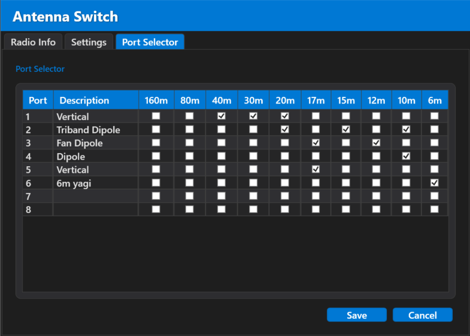

# AntennaSwitchManager, automatic antenna switch software

This is a C# application with a WPF interface designed to control an automatic antenna switch for radio operation.

### ⚠️ Warning:
Please note that interlock functionality & FIFO (*First In First Out*) management are not implemented yet.

## Features

- **N1MM-Style UDP Support**: Receives N1MM-style UDP datagrams for frequency, mode, and band information.
- **Customizable Band to Port Mapping**: Configure which bands are assigned to each antenna switch port, with the option to add descriptive labels.
- **Configuration Storage**: All settings and configurations are serialized and saved in JSON format for easy persistence.
- **Band Status Indicators**: The currently selected band is highlighted with a green button background and changes to red during transmission.
- **Unsupported Bands**: Bands that are not supported by your antenna switch (i.e., no connected antennas) are greyed out.
- **Antenna Selection Memory**: If multiple antennas support the same band, you can switch between them. The last selected antenna is saved and used the next time you select that band.
- **TS-590SG Emulator**: A basic TS-590SG emulator that accepts N1MM-style UDP datagrams and generates CAT responses. It is partially compatible with OmniRig.
- **Supports KinKony KC868-A16**: Relay / controller boards like the KC868-A16 is brilliant to drive an antenna switch, I opted to use UDP

## TODO
- **SO2R Interlock**: Currently there is no Radio A -> radio B interlock functionality, if you have a 2x6 switch be careful.
- **SO2R FIFO**: First come first served, needs to be implemented.
- **Generic interlocking**: To avoid multiple relays becoming activated (this should be handled already but probably not fool proof).
- **LZ2RR switch compatability**:  [AntennaSwitch](https://github.com/stianeklund/AntennaSwitch) We already have an ugly implementation of this, could be ported to this project easily.
- **Add other means of receiving band data**: Maybe UDP isn't the best solution, could be possible to use MQTT as well as the KC868 supports it.
- **Improve GUI/Theme**: Nuff said.
- **Custom band/ frequency definition**: For other bands

## In action

## Port Selection & Configuration

Easily configure and select the appropriate ports for your antennas.

